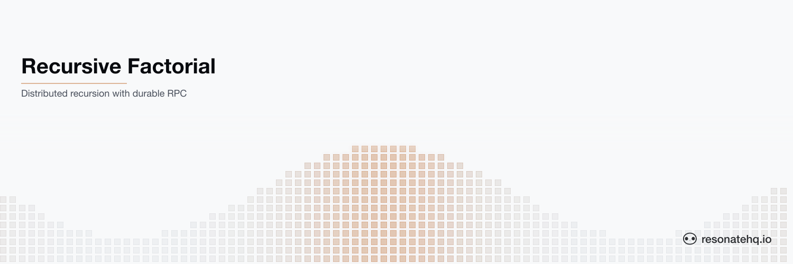

<picture>
  <source media="(prefers-color-scheme: dark)" srcset="./assets/banner-dark.png">
  <source media="(prefers-color-scheme: light)" srcset="./assets/banner-light.png">
  
</picture>

<p align="center">
  <a href="https://resonatehq.github.io/examples-ci/">
    
  </a>
</p>

# Recursive Factorial

**Resonate Rust SDK**

This example showcases Resonate's ability to durably invoke functions recursively.

Instructions on [How to run this example](#how-to-run-the-example) are below. The full pattern is documented at [docs.resonatehq.io/get-started/examples/recursive-factorial](https://docs.resonatehq.io/get-started/examples/recursive-factorial).

## The problem

There are two problems to address here.

The first problem exists within the context of platforms that provide "Durable Execution".

Most of these platforms force the usage of a "workflow" function and "step" / "activity" functions.
This is because the workflow function is paired with an event history, queue, or journal that is used during replay of the execution to know where to resume the execution without repeating side-effects.

This separation makes for a messy and expensive process for a workflow function to directly call itself.
It is messy in that the code is usually overly complicated, and it is expensive in that there are multiple events per invocation entered into the history, each of them often requiring a network call.
So, how do you have simple, clean, but also durable code?

The second problem is more general, which is how do you cache results for expensive operations and not repeat them?

Consider calculating factorials. The result of any given factorial is always the same. The greater the factorial, the more expensive the operation is.
It would be ideal to cache the result of an expensive operation in case it is needed again, right?

But where is the cache? What does the code look like to access it? How do you check if there is already a result there?

## The solution

Resonate's solution to both of these problems is the durable promise.

The first thing to know is that there is a 1:1 relationship between a durable promise and a function invocation.
That is — when a function is invoked, a single durable promise is created.
The durable promise represents the invocation event.
And it remains in a PENDING state until it is either RESOLVED with a result or REJECTED by the business process.

This means that there is no distinction between "workflow" functions and "step"/"activity" functions. Every function invocation is durable by default.

And this means it is relatively trivial for a function to call itself recursively without the code looking messy, and without that operation being expensive in terms of bloating an event history with unnecessary network calls.

The second thing to know is that a durable promise is a write-once register.
A durable promise is permanent, and once it has a value, its value will never change.

To be a permanent write-once register, each durable promise must have a unique ID in the system. Therefore the result of a durable promise becomes perfectly cacheable, with no cache invalidation required.

If you ever have to calculate the factorial of 5, you can attach the `factorial-5` promise ID to that invocation.
Once that has been calculated the promise is resolved, permanently storing the value inside it.

If any other operation needs the value of factorial 5, it can use the promise ID `factorial-5` and immediately receive the result.

## About this example

This example has a single `factorial` function that calls itself recursively across a worker group via `ctx.rpc`:

```rust
#[resonate::function]
async fn factorial(ctx: &Context, n: u64) -> Result<u64> {
    println!("Calculating factorial({n})");
    if n <= 1 {
        return Ok(1);
    }

    let result: u64 = ctx
        .rpc("factorial", n - 1)
        .target("poll://any@factorial-workers")
        .await?;

    Ok(n * result)
}

resonate.register(factorial).unwrap();
```

This function runs in `src/bin/worker.rs`.

As the operator, we recommend running three separate instances of the worker.

Then run the `client` binary while supplying a number to calculate.

You will see the factorial calculations spread out across the workers, each awaiting the result of factorial `n - 1`.

If you use a large enough number (anything 8 or above), you will see a delay while the final result is calculated.

Afterward, try running the same factorial calculation, or any number less than that, and you will see the calculation complete almost instantly.

This is because the result of each previously calculated factorial has been permanently "cached" in the corresponding durable promise.

The client uses the ID `factorial-{n}` for the top-level invocation, and the worker reuses the same ID scheme for each recursive `ctx.rpc` call. So moving forward, if any other operation in the application needs the result of a factorial, it only needs to call `factorial` with the promise ID `factorial-n` — and any factorial that has already been calculated will return the cached value directly.

## How to run the example

This example uses [Cargo](https://www.rust-lang.org/tools/install) as the build tool. After cloning, change directory into the project root.

This example application requires that a Resonate Server is running locally.

```shell
brew install resonatehq/tap/resonate
resonate dev
```

You will need at least two terminals to run this example — one or more for workers, and one for the client. This does not include the terminal where you started the Resonate Server.

In _Terminal 1_ (and optionally Terminals 2 and 3), start one or more workers:

```shell
cargo run --bin worker
```

In another terminal, run the client to calculate a factorial:

```shell
cargo run --bin client 6
```

Run the client a second time with the same number — or any smaller number — and watch the result come back instantly from the cached durable promises.

## Learn more

- [Resonate Documentation](https://docs.resonatehq.io)
- [Recursive Factorial Pattern](https://docs.resonatehq.io/get-started/examples/recursive-factorial)
- [Rust SDK Guide](https://docs.resonatehq.io/develop/rust)
